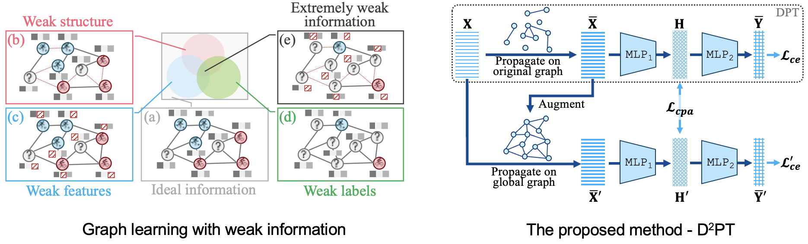

# D2PT
This is the source code of KDD'23 paper "Learning Strong Graph Neural Networks with Weak Information".



## Requirements
This code requires the following:
* Python==3.9
* Pytorch==1.12.1
* Pytorch Geometric==2.3.0

## Usage
Just run the script corresponding to the dataset and method you want. For instance:

```
bash scripts/d2pt/cora.sh
```

## Cite

If you compare with, build on, or use aspects of this work, please cite the following:
```
@inproceedings{
liu2023learning,
title={Learning Strong Graph Neural Networks with Weak Information},
author={Liu, Yixin and Ding, Kaize and Wang, Jianling and Lee, Vincent and Liu, Huan and Pan, Shirui},
booktitle={Proceedings of the 29th ACM SIGKDD Conference on Knowledge Discovery and Data Mining},
year={2023}
}
```
